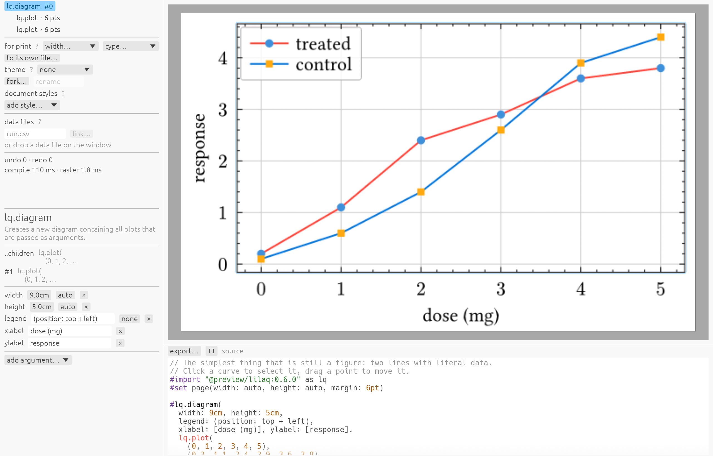

# lilook

**Edit a figure by pointing at it. Keep a file you can put in a paper.**

lilook is a graphical editor for [lilaq](https://lilaq.org) figures written in
[Typst](https://typst.app). Click a curve to select it, drag a point to move it,
pull the frame to resize it — and every gesture lands as a small edit in your own
`.typ` file, which stays plain Typst that `typst compile` reads without lilook
ever having existed.

### [Try it in your browser →](https://yipihey.github.io/lilook/)

No install, no account. A whole typesetter runs in the page.



---

## What it gives you

**Direct manipulation.** Pan, zoom, drag points, drag threshold lines, resize by
the axis frame. Undo is a text-edit history, so a gesture and a keystroke undo
the same way.

**A control for everything lilaq can do.** Every function and style element in
lilaq 0.6 has a real widget — colours, strokes, marks, scales, alignments — with
gradient previews for colour maps and colourblind-safe palettes for series.
Nothing falls through to a text box unless the value genuinely has no small form.

**A source pane that teaches.** Semantic colouring, where a series call wears the
colour it draws. Completion of parameters *and* their values, so picking `smooth`
writes `interpolation: "smooth"`. Hover a call to read its whole signature.
Inline hints show what `auto` resolved to — `xlim: auto  ⟨0.82 … 4.18⟩` — which
is possible only because lilook has the compiled figure beside the text.

**Errors that lead somewhere.** lilaq raises most errors from inside itself, with
no line to point at. lilook finds the cause by removing one thing at a time and
recompiling — a few milliseconds each — then marks the offending bytes and offers
the repair:

```
value must be strictly positive
  caused by  yscale: "log"   ylim: (-1, 100)
  ↻ use a linear y axis      ↻ let lilaq choose the y limits
```

**Your data, still in your files.** Link a series to CSV, JSON, HDF5, npz, FITS
or Veusz's descriptor ASCII. The figure reads the file at compile time, so it
follows the data when the data changes — and *unlock* freezes the numbers into
the document when you want it self-contained.

**Publication output.** PDF and SVG for a paper, PNG for slides. Column-width
presets for the journals people actually submit to, and type sizes that survive
being placed.

**Themes.** lilaq's five, switchable in a click; fork one to get a copy you can
change and name.

---

## How it relates to Typst and lilaq

**lilaq** draws the figure. It is a Typst package, and lilook adds nothing to it:
every control here is a lilaq argument, and a generated schema means a new lilaq
release is picked up without lilook changing.

**Typst** is the document. lilook has no project format — no `.vsz`, no XML. The
`.typ` file *is* the model, and each edit is a byte-range replacement in it. Open
the same file in your text editor, in `typst watch`, or in a collaborator's
checkout, and it behaves exactly as it looks.

That is the load-bearing decision. It means you can adopt lilook for an afternoon
and abandon it without leaving anything behind, and it is why lilook can be a
graphical editor without becoming somewhere your work is trapped.

### `.lil` — a figure in its own file

Optional, and reversible. Move a figure out with one click and lilook writes
`flux.lil` beside your manuscript with an `#import` where the figure was — so a
figure becomes a thing you can find, reuse across a paper and a talk, and open on
its own by double-clicking it.

**A `.lil` is a Typst file.** The extension exists so your operating system knows
which application opens a figure; lilook cannot claim `.typ` without taking every
Typst file from the editor you already use. Nothing lilook-only is written into
one. `packaging/` has the desktop entry, the MIME type, the `Info.plist`
fragment, and the one-line mapping that keeps your editor's highlighting working.

---

## Running it

```sh
cargo run -p lilook-app -- figure.typ    # desktop
scripts/web.sh release                   # build the browser bundle and serve it
```

Requires a Rust toolchain and nothing else: Typst compiles in process, and the
fonts and packages are inside the binary.

### For agents

```sh
cargo run -p lilook-compile --bin lilook-mcp -- /path/to/project
```

An MCP server over stdio, so an agent can build and tweak a figure — and check
its work, because `render` reports what was drawn, how many points, and where the
axes ended up rather than only whether it failed. Five tools with hierarchical
discovery, since a tool per lilaq function would cost about 18,000 tokens on
every request.

---

## Building on it

The editing core has no GUI dependency. A `Session` holds the document and every
operation — link, unlock, theme, gesture, completion, quick fix — and returns
plain data for a frontend to render. That is why one core drives a desktop
window, a browser tab, a SwiftUI view through a C ABI, and the MCP server.

```
lilook-core      document, intents, history, scene, schema, session, capabilities
lilook-compile   in-process Typst: probes, scene recovery, export, blame
lilook-data      npz, FITS, HDF5, Veusz ASCII, CBOR sidecars
lilook-ui        egui widgets            lilook-editor  panels
lilook-app       desktop                 lilook-web     browser
lilook-ffi       C ABI for Swift / Python / Julia
```

`scripts/check.sh` is the gate: format, clippy, every test, and a real `typst`
recompile of what the tests produced.

`docs/plan-2.0.md` is the architecture. `docs/findings.md` records what was
measured rather than assumed — several early assumptions were overturned, and
both the guess and the number are kept.

---

© Tom Abel. MIT licence. Figures belong to the people who make them.
